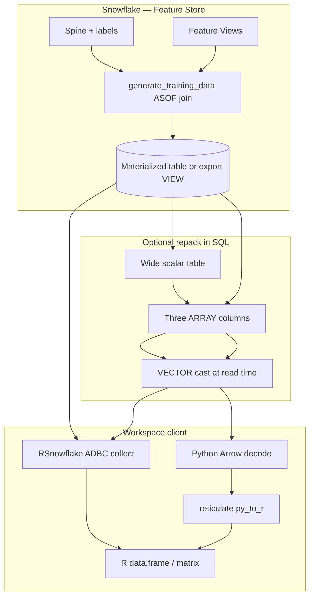

## Overview

Once connected ([Connect chapter](../12_rsnowflake_connect/index.qmd)), RSnowflake gives you three layers of data access:

1. **DBI** — standard R database interface (`dbGetQuery`, `dbWriteTable`, …)
2. **dbplyr** — dplyr verbs translated to SQL and executed **in Snowflake**
3. **Bulk I/O** — optimized paths for large reads/writes (Snowpark, ADBC, or literal SQL)

The design goal is **push computation to the data**. Your R session sends SQL; the **warehouse** aggregates, filters, and joins close to storage. You `collect()` only what you need for modeling or visualization.

## Learning Objectives

- Run queries, DDL, and table operations with DBI
- Build lazy dplyr pipelines that execute on the warehouse
- Use RSnowflake-only dbplyr translations (semi-structured types, `OBJECT_AGG`, approximate aggregates)
- Choose SQL API vs ADBC for semi-structured reads (account settings, native Arrow types)
- Parse or unpack OBJECT / ARRAY / VECTOR into native R types (SQL-first, then client-side)
- Follow an end-to-end pipeline matched to how features are stored (scalar-wide, ARRAY, OBJECT, three-VECTOR export)
- Choose read paths for Feature Store training data (`save_as`, RSnowflake + ADBC, or Python decode)
- Understand how RSnowflake chooses bulk write/read backends
- Know SQL API limits that affect stage I/O

---

## Query execution model {#sec-model}

```{mermaid}
flowchart LR
  R[R session RSnowflake]
  API[SQL REST API or ADBC]
  WH[Warehouse]
  STG[(Tables / stages)]
  R --> API --> WH --> STG
```

| Step | Where it runs |
|------|---------------|
| dplyr pipeline before `collect()` | SQL built in R; **not executed** yet |
| `collect()`, `dbGetQuery()` | **Warehouse** executes SQL |
| Result transfer | JSON (SQL API) or Arrow (ADBC) to R |

Bulk **writes** from R (`dbWriteTable`, `dbAppendTable`) use separate routing — see [§Bulk write routing](#sec-bulk). Prefer **not** loading huge tables into R only to write them back; materialize with SQL/dbplyr when possible.

---

## DBI basics {#sec-dbi}

### Reads and parameterized queries

```r
df <- dbGetQuery(con, "SELECT * FROM MY_DB.MY_SCHEMA.MY_TABLE LIMIT 100")

df <- dbGetQuery(con,
  "SELECT * FROM users WHERE age > ?",
  params = list(21L)
)
```

Parameterized queries avoid SQL injection and help the optimizer reuse plans.

### DDL and DML

```r
dbExecute(con, "CREATE TABLE test_tbl (id INT, name VARCHAR)")
dbExecute(con, "INSERT INTO test_tbl VALUES (1, 'Alice')")
```

`dbExecute()` returns rows affected; use for statements without result sets.

### Table round-trip

```r
dbWriteTable(con, "iris_copy", iris, overwrite = TRUE)
iris_back <- dbReadTable(con, "iris_copy")
dbAppendTable(con, "iris_copy", iris[1:10, ])
dbRemoveTable(con, "iris_copy")
```

::: {.callout-note}
Use **fully qualified** names when Workspace session context is unset. RSnowflake uppercases unquoted identifiers by default — see [Connect §case](../12_rsnowflake_connect/index.qmd#sec-case).
:::

---

## dbplyr: lazy SQL from dplyr {#sec-dbplyr}

**dbplyr** turns dplyr into a SQL compiler. Tables become lazy; verbs append to a query plan until you **`collect()`**:

```r
library(dplyr)

tbl(con, in_schema("MY_SCHEMA", "ORDERS")) |>
  filter(STATUS == "OPEN", ORDER_DATE >= "2024-01-01") |>
  group_by(REGION) |>
  summarise(
    n       = n(),
    revenue = sum(AMOUNT, na.rm = TRUE),
    .groups = "drop"
  ) |>
  arrange(desc(revenue)) |>
  collect()   # single SQL round trip
```

**Why lazy matters:** `filter()` and `summarise()` do not pull data to R. A 10-billion-row table stays in Snowflake until the final aggregation is computed on the warehouse.

::: {.callout-warning}
dbplyr keeps Snowflake's **UPPERCASE** column names. snowflakeR's `sfr_query()` lowercases — do not mix blindly in joins between APIs.
:::

Generic Snowflake translations (`floor_date()` → `DATE_TRUNC`, `paste0()` → `ARRAY_TO_STRING`, `ifelse()` → `IFF`, and many more) come from **dbplyr** via `dbplyr::simulate_snowflake()`. RSnowflake **adds** the Snowflake-only functions below — they are not available when you use ODBC/dbplyr against Snowflake from other drivers.

Full tables: [RSnowflake getting-started vignette](https://github.com/Snowflake-Labs/RSnowflake/blob/main/vignettes/getting-started.Rmd#snowflake-specific-sql-translations) · [Appendix H — `getting-started` HTML](../appendices/H_package_vignettes/index.qmd#sec-snowflaker).

---

## RSnowflake-only dplyr translations {#sec-snowflake-dbplyr}

Use these inside `mutate()`, `filter()`, and `summarise()` on `tbl(con, ...)`. They compile to Snowflake SQL and run on the warehouse.

### Semi-structured scalars

| R function | Snowflake SQL | Typical use |
|------------|---------------|-------------|
| `parse_json(x)` | `PARSE_JSON(x)` | VARCHAR → VARIANT |
| `try_parse_json(x)` | `TRY_PARSE_JSON(x)` | Safe parse (NULL on bad JSON) |
| `typeof(x)` | `TYPEOF(x)` | Inspect VARIANT element type |
| `is_object(x)` | `IS_OBJECT(x)` | Branch on OBJECT payloads |
| `is_array(x)` | `IS_ARRAY(x)` | Branch on ARRAY payloads |
| `is_integer(x)` | `IS_INTEGER(x)` | VARIANT holds integer |

### Array scalars

| R function | Snowflake SQL | Notes |
|------------|---------------|-------|
| `array_size(x)` | `ARRAY_SIZE(x)` | Length of ARRAY |
| `array_contains(arr, val)` | `ARRAY_CONTAINS(val, arr)` | RSnowflake swaps arg order to match Snowflake |
| `array_slice(arr, from, to)` | `ARRAY_SLICE(arr, from, to)` | Sub-array |

### Strings and hashing

| R function | Snowflake SQL | Notes |
|------------|---------------|-------|
| `regexp_substr(x, pattern, ...)` | `REGEXP_SUBSTR(...)` | Snowflake-specific args (`pos`, `occ`, `params`) |
| `hash(...)` | `HASH(...)` | Stable hash across columns |

### Aggregates (inside `summarise()`)

| R function | Snowflake SQL | Typical use |
|------------|---------------|-------------|
| `object_agg(key, value)` | `OBJECT_AGG(key, value)` | Bundle many rows into one OBJECT per group |
| `array_agg(x)` | `ARRAY_AGG(x)` | Positional feature vector as ARRAY |
| `array_unique_agg(x)` | `ARRAY_UNIQUE_AGG(x)` | Distinct ARRAY elements |
| `approx_count_distinct(x)` | `APPROX_COUNT_DISTINCT(x)` | Cheap cardinality on large groups |
| `approx_percentile(x, p)` | `APPROX_PERCENTILE(x, p)` | Approximate quantiles |
| `mode_val(x)` | `MODE(x)` | Statistical mode (`mode_val` avoids `base::mode()`) |

Window variants of the aggregate functions above are also registered for analytic queries.

### Example: events with JSON payloads

```r
library(dplyr)

tbl(con, in_schema("CLICKSTREAM_DATA", "EVENTS")) |>
  mutate(payload = parse_json(RAW_JSON)) |>
  filter(is_object(payload)) |>
  group_by(EVENT_TYPE) |>
  summarise(
    user_ids   = array_unique_agg(USER_ID),
    n_users    = approx_count_distinct(USER_ID),
    .groups    = "drop"
  ) |>
  collect()
```

### Example: bundle sparse features into OBJECT (Feature Store pattern)

Snowflake's [Feature Store advanced patterns](https://snowflake-labs.github.io/snowflake-featurestore-imp-guide/12_advanced_patterns/#sec-wide-sparse) recommend **OBJECT** (or **ARRAY**) columns to avoid thousand-column tables. You can **build** those bundles in dplyr on the warehouse, then register the result as an external feature view from [Feature Store](../17_feature_store/index.qmd) or materialize with `compute()`.

```r
# Long/narrow source: one row per (entity, feature_name, value)
bundled <- tbl(con, in_schema("FEATURE_STORE", "ENTITY_FEATURES_LONG")) |>
  group_by(ENTITY_ID) |>
  summarise(
    FEATURE_OBJECT = object_agg(FEATURE_NAME, FEATURE_VALUE),
    .groups = "drop"
  )

bundled |> show_query()

# Persist for reuse (session temp table) or inspect a sample
feature_sample <- bundled |> head(100) |> collect()
```

For **fixed keys** (known feature names), `OBJECT_CONSTRUCT` in SQL is often clearer — use `dbGetQuery()` or `mutate(feature_object = sql("OBJECT_CONSTRUCT('avg_spend', AVG_SPEND, 'n_orders', N_ORDERS)"))` after a `summarise()` step.

**Path access** (`payload:field::FLOAT`, bracket notation) is not wrapped as dplyr helpers today. Use `dbGetQuery()` or `mutate(x = sql("FEATURE_OBJECT:avg_spend::FLOAT"))` for extraction expressions.

---

## Semi-structured columns in R {#sec-semi-structured-read}

How semi-structured columns appear in R depends on **which RSnowflake transport** you use:

| Transport | When | Semi-structured in R (typical) |
|-----------|------|--------------------------------|
| **SQL API** (default) | `RSnowflake.backend = "auto"` and ADBC not installed, or ADBC failed | VARIANT, OBJECT, ARRAY, VECTOR → **character** (JSON text per cell) |
| **ADBC** | `adbcsnowflake` installed + `options(RSnowflake.backend = "adbc")` | Scalars native; **VECTOR** often **list** columns of numbers; typed ARRAY / structured OBJECT may be native **if** account flag is on (below) |

Scalar columns (`DOUBLE`, `NUMBER`, timestamps, …) are native in both paths. Feature Store training tables that are mostly scalars still benefit from ADBC for **volume** (columnar transfer, less parsing overhead on numerics).

### Recommendation for Feature Store workloads

For **retrieving training data into R** when views use OBJECT, ARRAY, or VECTOR:

1. **Materialize in Snowflake** — `sfr_generate_training_data(..., save_as = "MY_TRAINING")` or a managed table / export view ([§Feature Store training data](#sec-feature-store-read)).
2. **Read with RSnowflake + ADBC** — install `adbcsnowflake` (CRE or bootstrap), then:

```r
options(RSnowflake.backend = "adbc")   # force Arrow path for reads

library(dplyr)
training <- tbl(con, in_schema("ML", "MY_TRAINING")) |>
  head(100000) |>
  collect()
```

3. **Prefer unpacking in SQL** when you can — see [§Extract in SQL (dplyr)](#sec-sql-extract) — so `collect()` returns scalars even on the SQL API path.
4. **Reserve client-side JSON parsing** for VARIANT/OBJECT bundles you cannot flatten in SQL, or for validation samples (`LIMIT`).

`sfr_generate_training_data()` without `save_as` still goes through **snowflakeR → pandas → R**; it does not use RSnowflake ADBC. Use `save_as` + RSnowflake when semi-structured or wide training pulls are the bottleneck.

### Why Feature Store users care

Snowflake recommends **OBJECT** or **ARRAY** columns to avoid thousand-column tables — see [Feature Store Implementation Guide — Wide & sparse](https://snowflake-labs.github.io/snowflake-featurestore-imp-guide/12_advanced_patterns/#sec-wide-sparse). Joining **multiple Feature Views** can still produce hundreds of scalar columns even when each view is modest ([§Wide training sets](#sec-wide-training)).

| Pattern | In Snowflake | SQL API → R | ADBC → R (with account settings) |
|---------|--------------|-------------|----------------------------------|
| Many scalar columns | One column per feature | Native types | Native types (faster at scale) |
| VARIANT / untyped OBJECT | Flexible JSON blob | JSON **character** | JSON **character** (no native Arrow) |
| Typed ARRAY / structured OBJECT | Declared element types | JSON **character** | Native list/struct **if** account flag enabled |
| VECTOR packs | Fixed-length numerics | JSON **character** | Often **list** column → `matrix` (no account flag required) |

RSnowflake helps you **build** bundles on the warehouse (`object_agg`, `array_agg`, `::VECTOR`); **how** you read them is a separate choice between SQL flattening, ADBC, and client-side decode.

Use [§End-to-end training export pipelines](#sec-e2e-pipelines) below to pick a full workflow — not only a read transport.

---

## End-to-end training export pipelines {#sec-e2e-pipelines}

Each pipeline is a **single story** from Feature Store (or SQL) through materialization in Snowflake to an R (or R+Python) training frame. Steps assume a **multilang Workspace notebook**: snowflakeR for Feature Store APIs, RSnowflake for reads, optional **ADBC** in R ([§ADBC setup](#sec-adbc-semistructured)).

### Choose a pipeline

| How features live today | Combined ASOF / training width | Recommended pipeline |
|-------------------------|--------------------------------|----------------------|
| Scalar columns per feature | &lt; ~100 columns total | [Pipeline A — scalar, direct](#sec-pipeline-a) |
| Scalar columns per feature | 100+ columns after multi–Feature View join | [Pipeline B — scalar-wide → three VECTOR packs](#sec-pipeline-b) |
| **ARRAY** columns (typed packs) | Any | [Pipeline C — ARRAY-native](#sec-pipeline-c) |
| **OBJECT** / VARIANT JSON per row | Any | [Pipeline D — OBJECT-native](#sec-pipeline-d) |
| Packed export; maximum decode speed in notebook | Large row × width | [Pipeline E — Python decode → R](#sec-pipeline-e) |



---

### Pipeline A — Scalar features, moderate width {#sec-pipeline-a}

**When:** Each feature is its own column; total width after the ASOF join stays modest (rough guide: &lt; ~100 feature columns).

```{mermaid}
flowchart LR
  A1[Spine + Feature Views] --> A2[sfr_generate_training_data]
  A2 --> A3{Row count?}
  A3 -->|Demo / small| A4[Return R data.frame]
  A3 -->|Large or reuse| A5[save_as table]
  A5 --> A6[RSnowflake ADBC collect]
  A6 --> A7[Model in R]
  A4 --> A7
```

**1 — Register and join (R, snowflakeR)**

```r
library(snowflakeR)
conn <- sfr_connect()
fs   <- sfr_feature_store(conn, database = "MY_DB", schema = "ML")

fv1 <- sfr_get_feature_view(fs, "CUSTOMER_FEATURES", "v1")
fv2 <- sfr_get_feature_view(fs, "CUSTOMER_ACTIVITY", "v1")

spine_sql <- "
  SELECT customer_id, event_ts, churned AS label
  FROM MY_DB.ML.CHURN_SPINE
  WHERE event_ts >= '2024-01-01'
"
```

**2a — Small pull: straight to R**

```r
training <- sfr_generate_training_data(
  fs,
  spine               = spine_sql,
  features            = list(fv1, fv2),
  spine_timestamp_col = "event_ts",
  spine_label_cols    = "label",
  auto_prefix         = TRUE
)
# Scalar columns → ready for glm / tidymodels
```

**2b — Large or repeated reads: materialize, then ADBC**

```r
sfr_generate_training_data(
  fs,
  spine               = spine_sql,
  features            = list(fv1, fv2),
  spine_timestamp_col = "event_ts",
  spine_label_cols    = "label",
  auto_prefix         = TRUE,
  save_as             = "CHURN_TRAINING_SCALAR"
)
```

```r
%%R
library(DBI)
library(RSnowflake)
library(dplyr)

options(RSnowflake.backend = "adbc")
con <- dbConnect(Snowflake())

training <- tbl(con, in_schema("ML", "CHURN_TRAINING_SCALAR")) |>
  collect()
```

**Read transport:** [§ADBC](#sec-adbc-semistructured) · **Lineage Dataset (optional):** [§Feature Store Path 2](#sec-feature-store-read)

---

### Pipeline B — Scalar-wide ASOF → persist as three ARRAYs → VECTOR read → R {#sec-pipeline-b}

**When:** The point-in-time join is correct but **wide** (many scalar columns from one or more Feature Views). You want compile-friendly exports and efficient transport without pulling 500+ columns through the client.

**Idea:** Materialize the wide ASOF result once, then build an **export view** (or table) with exactly **three** `ARRAY` columns — float numerics, int ordinals/categoricals, null bitmask — and cast to `VECTOR` only in the `SELECT` you use for training reads.

```{mermaid}
flowchart LR
  B1[ASOF join save_as wide table] --> B2[Export VIEW: ARRAY_CONSTRUCT x3]
  B3[Read SQL: ::VECTOR casts] --> B4[ADBC collect]
  B4 --> B5[List columns to matrix in R]
  B2 --> B3
```

**1 — Wide ASOF materialization (R, snowflakeR)**

```r
sfr_generate_training_data(
  fs,
  spine               = spine_sql,
  features            = list(fv1, fv2, fv3),   # many scalar columns per view
  spine_timestamp_col = "event_ts",
  spine_label_cols    = "label",
  auto_prefix         = TRUE,
  save_as             = "CHURN_TRAINING_WIDE"
)
```

**2 — Repack to three ARRAY columns (SQL in Snowflake)**

Maintain a **feature manifest** (which columns are float vs categorical, imputation rules). Below is a **minimal** pattern; production pipelines generate this SQL from metadata (see [Implementation Guide §12.10](https://snowflake-labs.github.io/snowflake-featurestore-imp-guide/12_advanced_patterns/#sec-wide-sparse)).

```sql
CREATE OR REPLACE VIEW MY_DB.ML.CHURN_TRAINING_EXPORT AS
WITH base AS (
  SELECT * FROM MY_DB.ML.CHURN_TRAINING_WIDE
),
typed AS (
  SELECT
    customer_id,
    event_ts,
    label,
    -- example: three scalar features from the wide table
    CUSTOMER_FEATURES_V1_avg_order_total::FLOAT AS f_avg_spend,
    CUSTOMER_FEATURES_V1_order_count::INT       AS f_order_count,
    CUSTOMER_ACTIVITY_V1_page_views::FLOAT      AS f_page_views
  FROM base
),
packed AS (
  SELECT
    customer_id,
    event_ts,
    label,
    ARRAY_CONSTRUCT(
      COALESCE(f_avg_spend, 0),
      COALESCE(f_page_views, 0)
    ) AS features_float_arr,
    ARRAY_CONSTRUCT(
      COALESCE(f_order_count, 0)
      -- add ordinal-encoded categoricals here as INT elements
    ) AS features_int_arr,
    ARRAY_CONSTRUCT(
      IFF(f_avg_spend IS NULL, 1, 0),
      IFF(f_order_count IS NULL, 1, 0),
      IFF(f_page_views IS NULL, 1, 0)
    ) AS null_mask_arr
  FROM typed
)
SELECT * FROM packed;
```

**3 — Read with VECTOR cast + ADBC (R, RSnowflake)**

Cast at **read time** so the stored table stays ARRAY (Parquet-friendly); the planner sees three expressions regardless of feature count.

```r
options(RSnowflake.backend = "adbc")

export <- dbGetQuery(con, "
  SELECT
    customer_id,
    event_ts,
    label,
    features_float_arr::VECTOR(FLOAT, 2) AS features_float,
    features_int_arr::VECTOR(INT, 1)     AS features_int,
    null_mask_arr::VECTOR(INT, 1)        AS null_mask
  FROM MY_DB.ML.CHURN_TRAINING_EXPORT
")

X_float <- do.call(rbind, export$FEATURES_FLOAT)
X_int   <- do.call(rbind, export$FEATURES_INT)
# Apply null_mask using your manifest; bind_cols with labels for modeling
```

**Decode details:** [§ADBC unpack](#sec-parse-adbc) · **Python variant:** [Pipeline E](#sec-pipeline-e)

---

### Pipeline C — Features already stored as ARRAY columns {#sec-pipeline-c}

**When:** Feature Views (or ETL) already expose **typed `ARRAY(...)`** packs — no wide scalar table to repack.

```{mermaid}
flowchart LR
  C1[Feature View with ARRAY cols] --> C2[ASOF join save_as]
  C2 --> C3[SELECT with optional ::VECTOR]
  C3 --> C4[ADBC collect + list to matrix]
```

**1 — Feature View SQL (ARRAY in the definition)**

```r
fv_arrays <- sfr_create_feature_view(
  fs,
  name       = "CUSTOMER_FEATURES_ARRAY",
  version    = "v1",
  entities   = customer,
  feature_df = "
    SELECT
      customer_id,
      ARRAY_CONSTRUCT(avg_order_total, page_views) AS features_float_arr,
      ARRAY_CONSTRUCT(order_count)                 AS features_int_arr
    FROM analytics.customer_rollup
  "
)
```

**2 — Point-in-time training materialization**

```r
sfr_generate_training_data(
  fs,
  spine               = spine_sql,
  features            = list(fv_arrays),
  spine_timestamp_col = "event_ts",
  spine_label_cols    = "label",
  save_as             = "CHURN_TRAINING_ARRAY"
)
```

**3 — Read (R + ADBC)**

With account flag `ENABLE_STRUCTURED_TYPES_IN_CLIENT_RESPONSE = TRUE`, typed ARRAY may arrive as **list** columns without JSON parsing ([§ADBC](#sec-adbc-semistructured)). Otherwise treat as character JSON ([§SQL API parse](#sec-parse-json)).

```r
options(RSnowflake.backend = "adbc")

rows <- dbGetQuery(con, "
  SELECT
    customer_id,
    label,
    features_float_arr::VECTOR(FLOAT, 2) AS features_float,
    features_int_arr::VECTOR(INT, 1)     AS features_int
  FROM MY_DB.ML.CHURN_TRAINING_ARRAY
  LIMIT 100000
")

X <- do.call(rbind, rows$FEATURES_FLOAT)
```

**Parquet / Dataset note:** Prefer **typed ARRAY** in storage for file export; untyped semi-structured ARRAY may serialize as JSON in Parquet ([§VECTOR — Parquet](#sec-vector)).

---

### Pipeline D — Features stored as OBJECT / VARIANT {#sec-pipeline-d}

**When:** One **OBJECT** (or VARIANT) column per entity row — flexible schema, sparse keys, Feature Store “wide & sparse” pattern.

```{mermaid}
flowchart LR
  D1[OBJECT in Feature View or object_agg] --> D2[ASOF join save_as]
  D2 --> D3{Export strategy}
  D3 -->|R-friendly scalars| D4[SQL path extract in VIEW]
  D3 -->|Scale| D5[OBJECT to VECTOR export SQL]
  D3 -->|Sample only| D6[jsonlite in R]
  D4 --> D7[ADBC collect]
  D5 --> D7
```

**1 — Feature View with OBJECT bundle**

```r
# Long/narrow upstream, or ETL — bundle in SQL
fv_obj <- sfr_create_feature_view(
  fs,
  name       = "CUSTOMER_FEATURES_OBJECT",
  version    = "v1",
  entities   = customer,
  feature_df = "
    SELECT customer_id,
           OBJECT_CONSTRUCT(
             'avg_spend', AVG(order_total),
             'n_orders',  COUNT(*)
           ) AS feature_object
    FROM orders
    GROUP BY customer_id
  "
)
```

Or build with dplyr + `object_agg()` ([§OBJECT bundle example](#sec-snowflake-dbplyr)) before registration.

**2 — ASOF join**

```r
sfr_generate_training_data(
  fs,
  spine               = spine_sql,
  features            = list(fv_obj),
  spine_timestamp_col = "event_ts",
  spine_label_cols    = "label",
  save_as             = "CHURN_TRAINING_OBJECT"
)
```

**3a — Export for R: flatten in SQL (recommended)**

ADBC does **not** turn VARIANT into native structs. Project keys in an export view:

```sql
CREATE OR REPLACE VIEW MY_DB.ML.CHURN_TRAINING_OBJECT_FLAT AS
SELECT
  customer_id,
  event_ts,
  label,
  feature_object:avg_spend::FLOAT AS avg_spend,
  feature_object:n_orders::INT  AS n_orders
FROM MY_DB.ML.CHURN_TRAINING_OBJECT;
```

```r
options(RSnowflake.backend = "adbc")
training <- tbl(con, in_schema("ML", "CHURN_TRAINING_OBJECT_FLAT")) |> collect()
```

Or dplyr: [§Extract in SQL](#sec-sql-extract).

**3b — Export at scale: OBJECT → three VECTOR packs**

For hundreds of keys, generate export SQL from a **feature manifest** (path extract → encode → `ARRAY_CONSTRUCT` → `::VECTOR`) — same pattern as [Pipeline B](#sec-pipeline-b) step 2, starting from `feature_object:field::TYPE` instead of wide scalars. Then read with Pipeline B step 3 or [Pipeline E](#sec-pipeline-e).

**3c — Validation sample: JSON in R**

```r
sample <- dbGetQuery(con, "
  SELECT customer_id, label, feature_object
  FROM MY_DB.ML.CHURN_TRAINING_OBJECT
  LIMIT 5000
")
feats <- vapply(sample$FEATURE_OBJECT, jsonlite::fromJSON, FUN.VALUE = numeric(0), simplify = FALSE)
```

Do not use 3c for full training volume.

---

### Pipeline E — Python Arrow decode, R modeling (multilang) {#sec-pipeline-e}

**When:** You use [Pipeline B](#sec-pipeline-b) or [D→B](#sec-pipeline-d) export views with three VECTOR columns and want **maximum** client throughput (NumPy zero-copy on `fixed_size_list`), then model in R.

| Step | Language | Action |
|------|----------|--------|
| 1 | R | Feature Store registration + `save_as` / export VIEW (Pipelines B or D) |
| 2 | Python | `session.sql(...)` on export VIEW → Arrow/pandas → decode mask + packs → `X`, `y` |
| 3 | R | `reticulate::py_to_r()` or pass matrices only |

```python
# Python cell — same session as snowflakeR
df = session.sql("""
  SELECT customer_id, label,
         features_float_arr::VECTOR(FLOAT, 1000) AS features_float,
         features_int_arr::VECTOR(INT, 400)     AS features_int,
         null_mask_arr::VECTOR(INT, 32)         AS null_mask
  FROM MY_DB.ML.CHURN_TRAINING_EXPORT
""").to_pandas()
# ... decode to numpy X, y per your wide-table metadata ...
```

```r
%%R
library(reticulate)
y <- py$y
X <- py_to_r(py$X)
```

**Contrast:** Default `sfr_generate_training_data()` without `save_as` does **not** run this decode path ([§Feature Store reads](#sec-feature-store-read)).

---

### Shared prerequisites

| Requirement | Pipelines |
|-------------|-----------|
| snowflakeR + `sfr_connect()` | A–E |
| `sfr_generate_training_data(..., save_as = ...)` | A–E (materialize) |
| `adbcsnowflake` in R (CRE/bootstrap) | A–D (ADBC reads) |
| `ENABLE_STRUCTURED_TYPES_IN_CLIENT_RESPONSE` (account) | C (typed ARRAY as native Arrow) |
| Python + reticulate | E |
| Feature manifest for repack / decode | B, D→B, E |

---

## ADBC, Arrow, and account settings {#sec-adbc-semistructured}

ADBC (`adbcsnowflake`) uses Snowflake's **Arrow** result path. That is the recommended read transport for **large** materialized training tables and for **VECTOR** / typed **ARRAY** columns — not a magic bypass for every semi-structured type.

### Enable ADBC in Workspace

| Step | Action |
|------|--------|
| Packages | `adbcsnowflake`, `adbcdrivermanager` (CRE image or bootstrap `languages.r.addons.adbc: true`) |
| Connection | Same `dbConnect(Snowflake())` — backend is lazy-initialised |
| Reads | `options(RSnowflake.backend = "adbc")` or leave `"auto"` when ADBC is installed |

See [RSnowflake in Workspace](../14_rsnowflake_workspace/index.qmd#sec-adbc) and [WORKSPACE_ADBC.md](https://github.com/Snowflake-Labs/RSnowflake/blob/main/WORKSPACE_ADBC.md).

### Account parameter for native structured types

Snowflake can return **typed ARRAY**, **structured OBJECT**, and **MAP** as native Arrow types instead of JSON strings. This is controlled at **account** scope (not session):

```sql
-- Accountadmin — one-time per account; confirm with your admin
ALTER ACCOUNT SET ENABLE_STRUCTURED_TYPES_IN_CLIENT_RESPONSE = TRUE;
```

| Column type | Native Arrow over ADBC? |
|-------------|---------------------------|
| Scalars (DOUBLE, INT, …) | Yes |
| **VECTOR(FLOAT/INT, n)** | Yes — `fixed_size_list` (does **not** require the account flag) |
| Typed **ARRAY(...)** | Yes **with** account flag; otherwise JSON strings |
| **Structured OBJECT** (`OBJECT(f1 DOUBLE, …)`) | Yes **with** account flag |
| **VARIANT** / untyped OBJECT | **No** — always JSON strings in Arrow |

Ask your account team whether the flag is already enabled before relying on native ARRAY/struct columns in R.

::: {.callout-warning}
**SQL API has no server-side Arrow.** `dbGetQuery()` on the REST path always uses JSON. `dbGetQueryArrow()` on the SQL API path builds Arrow **client-side** from JSON — interface compatibility only, not the same as ADBC transport.

For Feature Store exports you install **`adbcsnowflake` in the Workspace R environment** (CRE or bootstrap), materialize training with `save_as`, then read that table through RSnowflake with `options(RSnowflake.backend = "adbc")`. That is a **client-side ADBC driver** talking Arrow to Snowflake — not `dbGetQueryArrow()` on the REST API.
:::

### Inspect what you received

After `collect()`, inspect column classes before choosing a decoder:

```r
options(RSnowflake.backend = "adbc")
sample <- dbGetQuery(con, "SELECT * FROM MY_DB.ML.MY_TRAINING LIMIT 100")
str(sample, max.level = 1)
# PACKED_FLOATS   : List of 100  | num [1:128]  ...  → VECTOR over ADBC
# FEATURE_OBJECT  : chr [1:100]  ...                 → VARIANT/OBJECT JSON
# AVG_SPEND       : num ...                          → scalar
```

---

## Extract in SQL (dplyr) {#sec-sql-extract}

The most portable and often fastest approach: **project features in SQL**, then `collect()` scalars only. Works with **SQL API or ADBC** and avoids JSON parsing in R entirely.

### OBJECT path access

```r
library(dplyr)

training <- tbl(con, in_schema("ML", "CUSTOMER_FEATURES_BUNDLED")) |>
  mutate(
    avg_spend = sql("FEATURE_OBJECT:avg_spend::FLOAT"),
    n_orders  = sql("FEATURE_OBJECT:n_orders::INTEGER")
  ) |>
  select(-FEATURE_OBJECT) |>
  collect()
```

### ARRAY → scalars (known positions)

```r
training <- tbl(con, "TRAINING_ARRAY_PACK") |>
  mutate(
    f1 = sql("feature_array[0]::FLOAT"),
    f2 = sql("feature_array[1]::FLOAT")
  ) |>
  select(-FEATURE_ARRAY) |>
  collect()
```

For hundreds of features, generate the `mutate()` expressions from a feature manifest in R, or build a **VIEW** in Snowflake that flattens once and register that as the Feature View backing table.

### VECTOR packs — keep packed for modeling

If the model expects a matrix, you may **keep** VECTOR/ARRAY columns through `collect()` and decode in R ([§ADBC client decode](#sec-parse-adbc)) rather than exploding to hundreds of scalar columns in SQL.

---

## SQL API: parse JSON in R {#sec-parse-json}

When results arrive as **character** JSON (SQL API path, or VARIANT/OBJECT over ADBC), use **`jsonlite`**. Prefer **`vapply()`** over `lapply()` + `rbind()` for thousands of rows.

### OBJECT column → named features per row

```r
library(jsonlite)

sample <- dbGetQuery(con, "
  SELECT entity_id, feature_object
  FROM MY_DB.ML.CUSTOMER_FEATURES_BUNDLED
  LIMIT 5000
")

# One row: named numeric vector
fromJSON(sample$FEATURE_OBJECT[1])

# All rows: list of named vectors, then rectangular data.frame
feat_list <- vapply(
  sample$FEATURE_OBJECT,
  fromJSON,
  FUN.VALUE = numeric(0),
  simplify = FALSE
)
# If every row has the same keys:
feat_mat <- do.call(rbind, lapply(feat_list, `[`, unique(names(feat_list[[1]]))))
training <- cbind(entity_id = sample$ENTITY_ID, as.data.frame(feat_mat))
```

If keys differ by row, normalize with **`tidyr::unnest_wider()`** after `tibble::enframe(feat_list)` or keep features in SQL with `feature_object:avg_spend::FLOAT` style extracts.

### ARRAY column → numeric matrix

```r
arr <- dbGetQuery(con, "
  SELECT entity_id, feature_array
  FROM MY_DB.ML.TRAINING_ARRAY_PACK
  LIMIT 5000
")

# Each cell is JSON like "[1.0, 2.5, ...]"
rows <- vapply(
  arr$FEATURE_ARRAY,
  function(s) fromJSON(s, simplifyVector = TRUE),
  FUN.VALUE = numeric(0)
)
X <- matrix(unlist(rows), nrow = nrow(arr), byrow = TRUE)
```

Check `ncol(X)` once against your declared array length; mismatches usually mean NULL or ragged arrays in source data.

### VECTOR column → numeric matrix

VECTOR values also arrive as JSON text on the SQL API path. The decode step is the same as ARRAY:

```r
vec <- dbGetQuery(con, "
  SELECT entity_id,
         packed_floats::VECTOR(FLOAT, 128) AS packed_floats
  FROM MY_DB.ML.TRAINING_VECTOR_PACK
  LIMIT 5000
")

float_rows <- vapply(
  vec$PACKED_FLOATS,
  function(s) fromJSON(s, simplifyVector = TRUE),
  FUN.VALUE = numeric(0)
)
X_float <- matrix(unlist(float_rows), nrow = nrow(vec), byrow = TRUE)
```

For production-sized training sets, **do not** rely on row-wise `fromJSON` over millions of rows unless columns are VARIANT/OBJECT with no SQL flatten path. Prefer [§Extract in SQL](#sec-sql-extract), **ADBC + list columns** ([§ADBC client decode](#sec-parse-adbc)), or Parquet — see [§Feature Store training data in R](#sec-feature-store-read).

---

## ADBC: unpack native Arrow columns in R {#sec-parse-adbc}

Use this path when `collect()` returns **list** columns (VECTOR or typed ARRAY with account flag), not JSON character.

### VECTOR or ARRAY as list column → matrix

```r
options(RSnowflake.backend = "adbc")

pack <- dbGetQuery(con, "
  SELECT entity_id,
         features_float_arr::VECTOR(FLOAT, 128) AS features_float
  FROM MY_DB.ML.TRAINING_VECTOR_PACK
  LIMIT 50000
")

# Each cell is already a numeric vector (not JSON text)
stopifnot(is.list(pack$FEATURES_FLOAT))
X <- do.call(rbind, pack$FEATURES_FLOAT)
dim(X)   # 50000 x 128

training <- data.frame(entity_id = pack$ENTITY_ID, X)
```

If a column is still **character**, fall back to [§SQL API: parse JSON](#sec-parse-json) — the warehouse or connection may not be using the Arrow path for that query.

### Typed ARRAY with account flag

```r
arr <- dbGetQuery(con, "
  SELECT entity_id, feature_array
  FROM MY_DB.ML.TRAINING_TYPED_ARRAY   -- ARRAY(DOUBLE) column
  LIMIT 10000
")

if (is.list(arr$FEATURE_ARRAY)) {
  X <- do.call(rbind, arr$FEATURE_ARRAY)
} else {
  # Flag off or untyped ARRAY — JSON character path
  X <- matrix(
    vapply(arr$FEATURE_ARRAY, jsonlite::fromJSON, numeric(0), simplify = TRUE),
    nrow = nrow(arr), byrow = TRUE
  )
}
```

### Mix scalar + packed columns

```r
library(dplyr)

training <- tbl(con, in_schema("ML", "MY_TRAINING")) |>
  mutate(
    label_num = sql("LABEL::FLOAT")
  ) |>
  collect()   # ADBC: scalars native; packs may be list or character

# Decode packed columns by class (see str(training) first)
if ("FEATURES_FLOAT" %in% names(training) && is.list(training$FEATURES_FLOAT)) {
  X_pack <- do.call(rbind, training$FEATURES_FLOAT)
}
if ("FEATURE_OBJECT" %in% names(training) && is.character(training$FEATURE_OBJECT)) {
  feats <- vapply(training$FEATURE_OBJECT, jsonlite::fromJSON, numeric(0), simplify = FALSE)
  # expand feats into columns as needed
}
```

For very large `n`, consider the **`arrow`** package on exported Parquet (Dataset files or `COPY INTO`) instead of expanding wide matrices in memory — see [§Feature Store training data](#sec-feature-store-read).

---

## VECTOR columns for wide feature exports {#sec-vector}

Snowflake **VECTOR** types store a fixed-length sequence of numbers (up to **4,096** elements per column). They are useful when you export hundreds or thousands of features but want the query planner to see only a **small number of columns** — not one expression per feature.

RSnowflake runs SQL that references `VECTOR(FLOAT, n)` and `VECTOR(INT, n)` without restriction. There are no dplyr helpers yet for `VECTOR_AVG` / `VECTOR_SUM`; write those in SQL with `sql()` or `dbGetQuery()`.

After `collect()` on the **SQL API** path, VECTOR columns are **character** (JSON) — use [§SQL API: parse JSON](#sec-parse-json). With **ADBC**, VECTOR is often a **list** column — use [§ADBC client decode](#sec-parse-adbc).

### Packed export layout (three columns)

A common layout for mixed numeric and categorical features stores data as ARRAY in tables, then casts to VECTOR at read time:

| Column | Type | Role |
|--------|------|------|
| `features_float` | `VECTOR(FLOAT, n)` | Imputed numerics |
| `features_int` | `VECTOR(INT, n)` | Ordinal-encoded categoricals |
| `null_mask` | `VECTOR(INT, ceil(n/32))` | Bitmask of which features were NULL |

The export SQL stays short regardless of feature count — the warehouse compiles three expressions instead of hundreds:

```r
export <- dbGetQuery(con, "
  SELECT
    entity_id,
    features_float_arr::VECTOR(FLOAT, 1000) AS features_float,
    features_int_arr::VECTOR(INT, 400)     AS features_int,
    null_mask_arr::VECTOR(INT, 32)         AS null_mask
  FROM MY_DB.ML.TRAINING_EXPORT_VIEW
  WHERE train_date = '2026-01-01'
  LIMIT 10000
")

# Validation sample — use ADBC + list decode when possible
options(RSnowflake.backend = "adbc")
if (is.list(export$FEATURES_FLOAT)) {
  X_num <- do.call(rbind, export$FEATURES_FLOAT)
} else {
  X_num <- matrix(
    vapply(export$FEATURES_FLOAT, jsonlite::fromJSON, numeric(0), simplify = TRUE),
    nrow = nrow(export), byrow = TRUE
  )
}
# Repeat for FEATURES_INT / null_mask; apply mask using your feature metadata
```

Define `features_*_arr` in the Feature View or a downstream Dynamic Table — not row-by-row in R. See the [Implementation Guide §12.10](https://snowflake-labs.github.io/snowflake-featurestore-imp-guide/12_advanced_patterns/#sec-wide-sparse) for platform patterns.

::: {.callout-note}
**Parquet and VECTOR:** Snowflake cannot write VECTOR columns directly to Parquet. For file-based pipelines, export **typed ARRAY** columns (or scalars) instead; VECTOR is for in-warehouse query and SQL API/ADBC reads.
:::

---

## Wide training sets: views, joins, and column count {#sec-wide-training}

For complete workflows (scalar-wide repack, ARRAY, OBJECT, Python decode), start at [§End-to-end pipelines](#sec-e2e-pipelines). This section summarises **why** width appears and **which pipeline** to pick.

Width is not only “one Feature View with 500 columns.” It also accumulates when you **join several Feature Views** into one training set:

```r
training_data <- sfr_generate_training_data(
  fs,
  spine    = spine_sql,
  features = list(
    list(name = "CUSTOMER_DEMOGRAPHICS", version = "v1"),  # 40 cols
    list(name = "CUSTOMER_TRANSACTIONS", version = "v1"), # 120 cols
    list(name = "PRODUCT_EMBEDDINGS",    version = "v1")  # 256 cols
  ),
  spine_timestamp_col = "event_ts",
  spine_label_cols    = "label",
  auto_prefix         = TRUE   # CUSTOMER_TRANSACTIONS_avg_spend, ...
)
```

Each view adds its feature columns (plus keys and optional timestamp columns). **`auto_prefix = TRUE`** avoids name collisions but **increases total width** — plan for hundreds of columns even when each view is modest.

| Situation | Pipeline |
|-----------|----------|
| Few views, &lt; ~100 **total** columns after join | [A — scalar direct](#sec-pipeline-a) |
| Several views → **100–500+ scalar columns** | [B — scalar-wide → three VECTOR packs](#sec-pipeline-b) |
| Features already **ARRAY** in views | [C — ARRAY-native](#sec-pipeline-c) |
| Features as **OBJECT** / VARIANT | [D — OBJECT-native](#sec-pipeline-d) (flatten SQL or B-style repack) |
| Maximum packed decode throughput | [E — Python → R](#sec-pipeline-e) |
| Multi-view name collisions | `auto_prefix = TRUE`; consider fewer views or pre-joined SQL |

---

## Feature Store training data in R {#sec-feature-store-read}

Feature Store training flows through **snowflakeR**, not RSnowflake alone — but the data types you get in R depend on **which read path** you choose.

### Path 1 — `sfr_generate_training_data()` (transient join)

Joins your spine to one or more Feature Views and returns an R **`data.frame`**:

```r
training <- sfr_generate_training_data(
  fs,
  spine    = spine_sql,
  features = list(fv1, fv2),
  spine_timestamp_col = "event_ts",
  spine_label_cols    = "label"
)
```

**What happens under the hood:** the Python Feature Store SDK runs the join in Snowflake, materializes a Snowpark result, converts it to **pandas**, then snowflakeR transfers columns into R (today via a JSON round-trip for compatibility with Workspace). Scalar feature columns arrive as normal R types. Any OBJECT/ARRAY/VECTOR columns in the join result follow the pandas/JSON path — treat them like SQL API character columns if they appear as strings.

**Materialize without pulling everything to R:**

```r
sfr_generate_training_data(
  fs,
  spine    = spine_sql,
  features = list(fv1, fv2),
  save_as  = "CHURN_TRAINING_V1",   # table in Feature Store schema
  spine_timestamp_col = "event_ts",
  spine_label_cols    = "label"
)

# Inspect or model from Snowflake with RSnowflake
library(dplyr)
training_tbl <- tbl(con, in_schema("FEATURE_STORE", "CHURN_TRAINING_V1"))
sample       <- training_tbl |> head(10000) |> collect()
```

Use `save_as` for wide or large training sets: validate joins in Snowflake, then read with RSnowflake + **ADBC** ([§ADBC and account settings](#sec-adbc-semistructured)):

```r
options(RSnowflake.backend = "adbc")
training_tbl <- tbl(con, in_schema("FEATURE_STORE", "CHURN_TRAINING_V1"))
sample       <- training_tbl |> head(100000) |> collect()
```

### Path 2 — `sfr_generate_dataset()` (versioned Dataset + lineage)

Creates an immutable **Snowflake ML Dataset** (Parquet files on a stage — the same object Python reads with **fsspec**):

```r
training <- sfr_generate_dataset(
  fs,
  name     = "CHURN_TRAINING",
  version  = "v1",
  spine    = spine_sql,
  features = list(fv1, fv2),
  spine_label_cols = "label"
)

attr(training, "dataset_name")     # for sfr_log_model() lineage
attr(training, "dataset_version")
```

**What R receives today:** the bridge reads the Dataset through **`Dataset.read.to_snowpark_dataframe().to_pandas()`** — not direct Parquet file access. That matches demo and moderate row counts; it is the same semantic data Python would get from an in-session read, not the maximum-throughput fsspec path.

**What Python does at scale:** after `generate_dataset()`, the SDK exposes Parquet files on internal storage:

```python
# Python (snowflake-ml) — not wrapped in snowflakeR yet
ds = session.dataset.load("MY_DB.ML.CHURN_TRAINING").select_version("v1")
files = ds.read.files()          # fsspec-compatible paths
# pd.read_parquet(files) or pyarrow.dataset
```

See [Snowflake ML Dataset — direct file access](https://docs.snowflake.com/en/developer-guide/snowflake-ml/dataset#direct-file-access).

**R options for large Datasets today:**

1. **`sfr_read_dataset(conn, name, version)`** — same pandas → R path as `sfr_generate_dataset()`; suitable when the Dataset already exists.
2. **`save_as` table + RSnowflake + ADBC** — recommended for wide/scalar-heavy training frames at scale ([§ADBC](#sec-adbc-semistructured)). Dataset Parquet still stores VARIANT as JSON strings on disk — same limitation as Python unless columns are typed ARRAY / scalars.
3. **Python decode + reticulate** — [Pipeline E](#sec-pipeline-e) for three-VECTOR export at maximum throughput.

A future snowflakeR release may add **`format = "parquet"`** on dataset reads (fsspec → `arrow::read_parquet()`). Until then, assume Dataset APIs in R are **lineage- and moderate-scale-friendly**, not a substitute for a full Parquet export pipeline.

**Full workflows by feature shape:** [§End-to-end pipelines](#sec-e2e-pipelines) (Pipelines A–E).

### Path 3 — RSnowflake only (custom SQL / dbplyr)

When you own the SQL (external Feature View table, export view, or `save_as` output), use RSnowflake directly:

```r
options(RSnowflake.backend = "adbc")   # recommended for materialized training reads

training_tbl <- tbl(con, in_schema("ML", "CHURN_TRAINING_V1"))
training     <- training_tbl |> collect()
# Scalars: native types. VARIANT/OBJECT: chr + §SQL API parse JSON.
# VECTOR / typed ARRAY (with account flag): list + §ADBC decode.
# Or flatten in dplyr first: §Extract in SQL
```

This path gives you the most control over **which columns** cross the wire — important when joins are wide.

::: {.callout-tip}
## Related chapters

- [Feature Store](../17_feature_store/index.qmd) — entities, views, `sfr_generate_training_data()`, Datasets  
- [§End-to-end pipelines](#sec-e2e-pipelines) — Pipelines A–E by storage shape  
- [Feature Store — Wide & sparse](../17_feature_store/index.qmd#sec-wide-sparse) — OBJECT/ARRAY in views  
- [RSnowflake in Workspace](../14_rsnowflake_workspace/index.qmd) — install and enable ADBC  
- [Model Registry](../18_model_registry/index.qmd) — `training_dataset` lineage from `sfr_generate_dataset()`
:::

### Materialize on the warehouse (`compute()`) {#sec-materialize}

**Anti-pattern:** `collect()` after every dplyr verb — data shuttles to R repeatedly.

**Better:** treat Snowflake as the execution engine. Build lazy pipelines; **materialize intermediate results as tables** when a step is expensive, reused, or hard to read as one nested query.

| Function | What it does | When to use |
|----------|--------------|-------------|
| **`collect()`** | Run SQL + pull all rows to R | Final modest result (modeling, plot, `head()`) |
| **`compute()`** | `CREATE TEMPORARY TABLE … AS` + return lazy handle | Multi-step ETL; break up joins; debug with `show_query()` per step |
| **`copy_to()`** | Upload local `data.frame` to a Snowflake table | Seed pipeline from R object |
| **`dbExecute()` + `sql_render()`** | Run explicit DDL you control | Permanent tables, `CREATE TABLE AS` with custom options |

```r
library(dplyr)

base <- tbl(con, in_schema("RAW", "EVENTS")) |>
  filter(event_date >= "2024-01-01")

# Materialize once on the warehouse (session-scoped temp table)
daily <- base |>
  group_by(customer_id, event_date) |>
  summarise(n_events = n(), .groups = "drop") |>
  compute(name = "daily_events_tmp")

# Continue from the materialized table — still lazy until collect()
features <- daily |>
  group_by(customer_id) |>
  summarise(avg_daily = mean(n_events), .groups = "drop")

# Permanent table (set session schema or use a fully qualified name)
features |>
  compute(name = "CUSTOMER_EVENT_FEATURES", temporary = FALSE)

# Or inspect SQL without executing
features |> show_query()
```

RSnowflake's `sql_query_save` generates Snowflake **`CREATE TEMPORARY TABLE`** (or permanent when `temporary = FALSE`). Temp tables live for the **session** — ideal for notebook pipelines; use qualified permanent names for shared artifacts.

**When to materialize vs one big query:** materialize when (1) an intermediate is reused in multiple branches, (2) the generated SQL is deeply nested or slow to optimize, or (3) you want to inspect row counts with `SELECT COUNT(*)` on a named table. Otherwise a single pipeline + one `collect()` is fine.

See [Platform Primer §storage-compute](../01_snowflake_platform/index.qmd#sec-storage-compute) for the mental model.

---

## Bulk write routing {#sec-bulk}

Small tables use batched **literal `INSERT`** over the SQL API. Above **`RSnowflake.bulk_write_threshold`** (cells = rows × columns; default **200,000** in Workspace, **50,000** elsewhere), `"auto"` picks a bulk backend.

### How `"auto"` chooses a path (current RSnowflake behaviour)

| Environment | Order when above threshold |
|-------------|----------------------------|
| **Workspace** | **ADBC** `write_adbc` (internal gateway) → **Snowpark** `write_pandas` (fallback) → literal INSERT |
| **Local / Posit** | **ADBC** → literal INSERT |

This differs from older docs that listed Snowpark as the Workspace default. After internal-gateway ADBC work (2026), **ADBC is preferred in Workspace** when `adbcsnowflake` is installed; Snowpark remains an explicit opt-in or fallback. See [WORKSPACE_ADBC.md](https://github.com/Snowflake-Labs/RSnowflake/blob/main/WORKSPACE_ADBC.md).

```{mermaid}
flowchart TD
  WT[dbWriteTable or dbAppendTable]
  AUTO{upload_method}
  BIG{cells >= threshold?}
  ADBC{ADBC installed?}
  SP{Snowpark plus reticulate?}
  ADBC_W[ADBC write_adbc from R]
  SP_W[reticulate r_to_py then write_pandas]
  LIT[Literal INSERT]

  WT --> AUTO
  AUTO -->|literal or small| LIT
  AUTO -->|auto and large| BIG
  BIG -->|no| LIT
  BIG -->|yes| ADBC
  ADBC -->|yes| ADBC_W
  ADBC -->|no| SP
  SP -->|yes| SP_W
  SP -->|no| LIT
```

| Method | What actually happens | When to use |
|--------|----------------------|-------------|
| `"auto"` | Routing table above | Default |
| `"adbc"` | R `data.frame` → Snowflake driver **PUT + COPY INTO** (no SQL API `PUT` from R) | Force Arrow path; bake into [CRE](../09_custom_runtime_and_ml_jobs/index.qmd) to skip per-session Go install |
| `"snowpark"` | R → **`reticulate::r_to_py()`** → pandas → active Snowpark session **`write_pandas()`** | Fallback in Workspace; explicit override |
| `"literal"` | SQL `INSERT` batches via REST | Small tables, debugging, no extra packages |

```r
options(RSnowflake.verbose = TRUE)   # log conversion and write timings
options(RSnowflake.upload_method = "auto")
dbWriteTable(con, "big_table", large_df)

options(RSnowflake.bulk_write_threshold = 100000L)  # rows × cols
```

### Is the Snowpark path copying the whole data frame through reticulate?

**Yes, when Snowpark is used.** RSnowflake converts the R `data.frame` in memory with `reticulate::r_to_py()`, then calls the Workspace kernel’s Snowpark `write_pandas()`. In RSnowflake benchmarks (~50k rows), that R→pandas step is on the order of **~0.2 seconds** — small next to network upload, but it still **duplicates the dataset in process memory** (R + Python) for the duration of the write.

**ADBC avoids the Python hop:** `write_adbc()` sends the R table through the Arrow/Snowflake driver (PUT + COPY under the hood), staying in the R process with no pandas intermediate.

### For very large data, prefer not to round-trip through R

| Approach | Why |
|----------|-----|
| **dbplyr / SQL** — `compute()`, `CREATE TABLE AS`, load from existing Snowflake tables | Data never leaves the warehouse |
| **Python Snowpark cell** — write from a DataFrame already in Python, or `session.write_pandas` from a file you read in Python | No R→Python copy for the bulk of the bytes |
| **Stage + `COPY INTO` (SQL)** | Classic warehouse pattern; RSnowflake’s SQL API driver **cannot** run client `PUT` — so “write CSV in R, then PUT” is **not** a built-in RSnowflake path; use a **Python** cell, Snowpark, or ADBC instead |
| **`dbWriteTable(large_df)` from R** | Convenient up to modest sizes; for millions of rows, memory and reticulate/ADBC cost dominate |

Writing CSV/Parquet locally and loading via Python is a valid **manual** pattern in a mixed notebook, but RSnowflake does not automatically spool to disk first — it passes the in-memory `data.frame` to ADBC or `r_to_py()`.

### Workspace benchmarks (order of magnitude)

From RSnowflake testing (~50k rows, Mar 2026 — your account may differ):

| Path | Typical time |
|------|----------------|
| Snowpark `write_pandas` (after `r_to_py`) | ~2–3 s |
| ADBC via internal `SNOWFLAKE_HOST` | ~7 s |
| Literal INSERT via SQL API | ~45 s |

So Snowpark can be **faster** when both are available, but **ADBC is the default** in `"auto"` because it avoids the reticulate dependency and matches bulk read auth. Use `options(RSnowflake.upload_method = "snowpark")` when you have measured Snowpark winning for your shape of data.

**Reads** follow a similar `"auto"` / `"adbc"` backend via `RSnowflake.backend`.

---

## Arrow and ADBC {#sec-arrow}

::: {.callout-note title="What is ADBC?"}
**ADBC** (Arrow Database Connectivity) is a **columnar database access standard** (Apache Arrow ecosystem). RSnowflake uses the Snowflake ADBC driver for bulk I/O; routine queries use the SQL API. [Glossary](../appendices/F_glossary/index.qmd) · [SQL API chapter](../11_rsnowflake_sql_api/index.qmd#sec-arrow).
:::

The Snowflake **ADBC** driver uses the Go Snowflake driver for columnar bulk transfer:

```r
requireNamespace("adbcsnowflake", quietly = TRUE)

options(RSnowflake.backend = "adbc")
df <- dbGetQuery(con, "SELECT * FROM big_table")
options(RSnowflake.backend = "auto")
```

**Workspace considerations:**

- Installing `adbcsnowflake` may require **Go compiler** and **EAI** for module downloads (~2 min cold bootstrap)
- ADBC can use internal **`SNOWFLAKE_HOST`** gateway with OAuth — no public URL required
- Bulk writes may still prefer Snowpark in `"auto"` even when ADBC is installed

Bake ADBC into a [CRE](../09_custom_runtime_and_ml_jobs/index.qmd) to avoid repeat installs. Deep dive: [WORKSPACE_ADBC.md](https://github.com/Snowflake-Labs/RSnowflake/blob/main/WORKSPACE_ADBC.md).

**`dbGetQueryArrow()`** provides DBI Arrow compatibility via `nanoarrow`. SQL API v2 returns JSON today — native server-side Arrow is on the roadmap; for large reads, `dbGetQuery()` with ADBC backend is the practical path.

---

## SQL API limitations {#sec-rest}

RSnowflake uses the [SQL REST API](../11_rsnowflake_sql_api/index.qmd). These affect **how** you I/O, not **whether** you can query:

| Unsupported | Implication |
|-------------|-------------|
| `GET` / `PUT` | No client-side stage transfer over REST |
| `USE DATABASE` / `SCHEMA` | Set context in connection or qualify names |
| `ALTER SESSION` | Set params via supported alternatives |

**SPCS workers** with RSnowflake must use **stage volume mounts** for file I/O — see [Parallel doSnowflake](../22_parallel_dosnowflake/index.qmd#sec-stage) and [Troubleshooting](../appendices/C_troubleshooting/index.qmd).

---

## Choosing an access pattern {#sec-choose}

| Goal | Pattern |
|------|---------|
| Ad hoc SQL | `dbGetQuery()` |
| ETL-style transforms | dbplyr pipeline + `compute()` for heavy steps + `collect()` at end |
| Large local export | ADBC backend + aggregate in SQL first |
| Workspace notebook write | `"auto"` or `"snowpark"` |
| ML platform objects | snowflakeR `sfr_*` APIs (may share DBI via `sfr_dbi_connection()`) |

---

## Next steps

[RSnowflake in Workspace](../14_rsnowflake_workspace/index.qmd) — bootstrap order, gateway, ADBC in notebooks.
